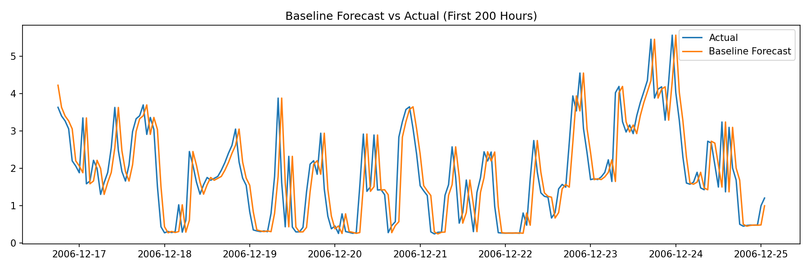
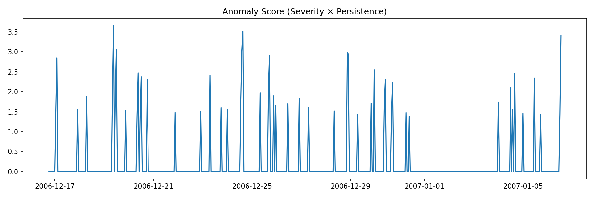

# Electricity Consumption Forecasting & Anomaly Detection

An explainable, precision-first time-series anomaly detection system for
household electricity consumption, built using forecast residuals and
persistence-based domain logic.

The project focuses on **practical anomaly detection under real-world
constraints**: no labels, noisy signals, and a need to minimize false alarms.

---

## Problem Overview

Detect abnormal electricity consumption behavior using historical load data,
where **only past consumption values are available at prediction time**.

Key constraints:
- No ground-truth theft or anomaly labels
- Anomalies are rare and ambiguous
- Strong daily patterns and high noise
- False positives are costly

---

## Dataset

- **UCI Individual Household Electric Power Consumption Dataset**
- Minute-level data from a single household
- Resampled to **hourly resolution** to reduce noise and reflect operational monitoring

Features used:
- Global_active_power
- Global_reactive_power
- Voltage
- Global_intensity
- Sub_metering_1 / 2 / 3

---

## Methodology

### 1. Baseline Forecasting

A naive persistence model was used as the forecasting baseline:

prediction(t) = consumption(t − 1)

The goal is not high forecast accuracy, but **well-behaved residuals**.
 Baseline vs Actual

---

### 2. Residual Diagnostics

Residuals were computed as:

residual = actual − predicted

They were analyzed using:
- Rolling mean and rolling standard deviation
- Visual inspection
- Autocorrelation checks

Findings:
- Residuals are approximately zero-mean
- Variance is stable over time
- No strong autocorrelation remains

This validates the baseline and enables residual-based anomaly detection.
Residual Diagnostics
.png)

---

### 3. Temporary vs Persistent Deviations

Single spikes are **not** treated as anomalies.

Defined:
- **Large error**: `|residual_z| > 2`
- **Persistence**: number of consecutive hours the error remains large

Rationale:
- Noise produces isolated spikes
- Behavioral change produces sustained deviation

This distinction is critical for avoiding false alarms.

---

### 4. Anomaly Scoring

An explainable anomaly score combines severity and persistence:

anomaly_score = |residual_z| × log(1 + persistence)

Why this works:
- Severity captures magnitude of deviation
- Persistence emphasizes sustained behavior
- Log scaling prevents domination by very long runs
 Anomaly Scores

---

### 5. Final Anomaly Rule

An anomaly is flagged only when:
- Error magnitude is large, and
- Deviation persists for **≥ 6 consecutive hours**

This hybrid approach combines statistical modeling with domain knowledge,
prioritizing **precision over recall**.

---

## Results

- Majority of anomaly scores remain near zero, indicating normal operation
- Rare, isolated spikes correspond to expected household events
- No sustained anomalies observed in the evaluated period
- System avoids false-alarm cascades

The behavior matches expectations for a healthy single-household dataset.

---

## Limitations

- Single-household data
- No verified anomaly labels
- No explicit seasonal forecasting model

These limitations are acknowledged and intentional for this stage.

---

## Future Extensions

- Seasonal baselines using ARIMA / SARIMA
- Multi-household or feeder-level modeling
- Semi-supervised learning with partial labels

---

## Key Takeaways

- Anomaly detection is a **system design problem**, not just a model choice
- Metrics and thresholds must respect data reality
- Persistence matters more than instantaneous spikes
- Simple baselines can be effective when validated properly

---

## Skills Demonstrated

- Time-series resampling and rolling statistics
- Forecast residual analysis
- Explainable anomaly detection
- Hybrid ML + rule-based system design
- Python, Pandas, NumPy, Matplotlib

